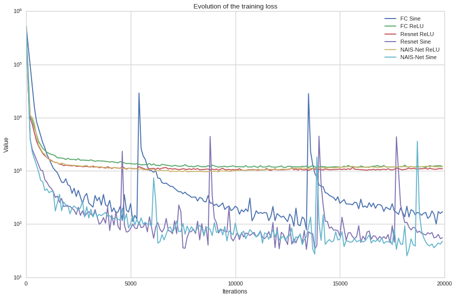

# Deep BSDE Solver

This project is part of my master thesis at Imperial College of London. We propose a deep learning approach to solve high-dimensional partial differential equations. The solver is tested on the Black-Scholes Barenblatt equation in 100 dimensions. 

## Usage

The repository needs to be cloned and running the BlackScholesBarenblatt100D.py will solve the Black-Scholes equation. 

```
$ git clone https://github.com/batuhanguler/Deep-BSDE-Solver.git
$ cd Deep-BSDE-Solver
$ python BlackScholesBarenblatt100D.py
```
Different architectures are available changing the **mode** and **activation** variables in the BlackScholesBarenblatt100D.py file. 


| Model       | mode  | activation |
| ------- |  ------- | ------- |
| **Fully-connected with sine activation**     | "FC" | "Sine"       |
| **Fully-connected with ReLU activation**     | "FC" | "ReLU"       |
| **Resnet with sine activation**     | "Resnet" | "Sine"        |
| **Resnet with ReLU activation**     | "Resnet" |"ReLU"     |
| **NAIS-Net with sine activation**     | "NAIS-Net" | "Sine"      |
| **NAIS-Net with ReLU activation**  |        "NAIS-Net"  |  "ReLU" |                             |


## Architectures


_**`Fully-connected`**_ 

A Pytorch version of [Forward-Backward Stochastic Neural Networks: Deep Learning of High-dimensional Partial Differential Equations](https://arxiv.org/pdf/1804.07010.pdf), a work from Maziar Raissi, is proposed. A simple fully-connected neural network with 5 layers of 256 parameters is implemented.


_**`Resnet`**_ Residual networks were proposed in 2015 and helped to backpropagate efficiently the gradient using identity mappings (shortcut connections).

_**`NAIS-Net`**_ [NAIS-Net](https://arxiv.org/abs/1804.07209) were proposed to overcome the problem of forward stability in Residual Networks. 
## Results



